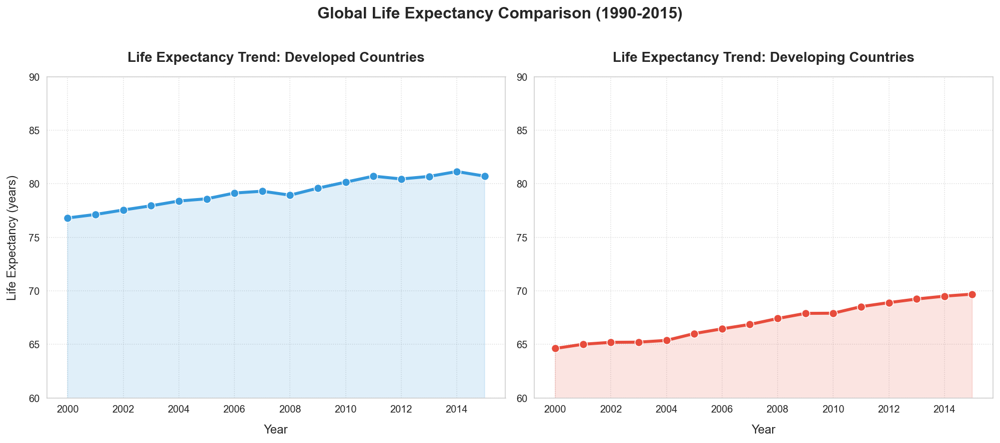
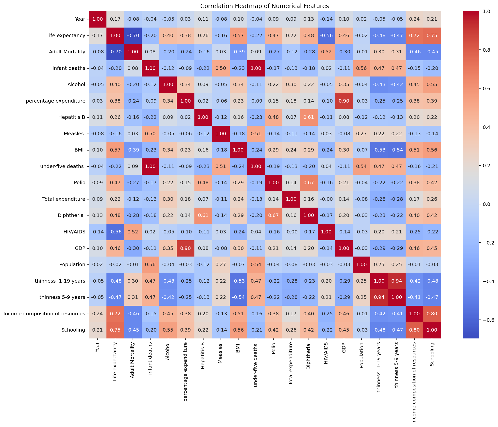
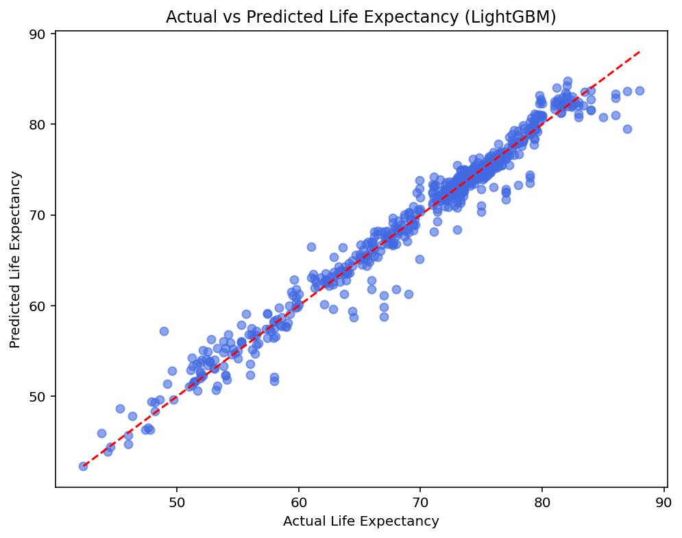

# Life Expectancy Prediction 🚑📈

This project predicts **Life Expectancy** using multiple machine learning models, including:

- **Linear Regression**
- **LightGBM**
- **CatBoost**

It evaluates each model using **R² Score** and **RMSE**, enabling you to identify the best performing model for the dataset.

---

## 📂 Project Structure

```

life-expectancy-prediction/
│
├── data/
│   └── life\_expectancy\_data.csv
│
├── life\_expectancy\_prediction.ipynb
├── requirements.txt
└── README.md

````

---

## 🛠️ Features

✅ Data Cleaning and Imputation  
✅ Feature Scaling (StandardScaler)  
✅ Model Training (Linear Regression, LightGBM, CatBoost)  
✅ Evaluation using R² and RMSE  
✅ Visualization of Predictions vs Actual Values  
✅ Ready for deployment as an API or integration into dashboards.

---

## 📊 Results

| Model              | R² Score | RMSE |
|---------------------|----------|------|
| **Linear Regression** | ~0.955  | ~1.97 |
| **LightGBM**         | ~0.967  | ~1.68 |
| **CatBoost**         | ~0.969  | ~1.65 |

CatBoost showed the best performance, indicating strong predictive capabilities using the prepared features.

---

## 📸 Visualizations

### 1️⃣ Global Life Expectancy Comparision



---

### 2️⃣ Variable Correlations



---

### 3️⃣ Actual vs Predicted (LightGBM)



---

### 4️⃣ Feature Importances


---

## 🚀 How to Run

1️⃣ Clone this repository:
```bash
git clone https://github.com/yourusername/life-expectancy-prediction.git
cd life-expectancy-prediction
````

2️⃣ Install dependencies:

```bash
pip install -r requirements.txt
```

3️⃣ Run the notebook:
Open `life_expectancy_prediction.ipynb` in Jupyter or VS Code and run all cells.

---

## 💡 Next Improvements

* Add **hyperparameter tuning** using GridSearchCV.
* Deploy using **FastAPI** for API predictions.
* Add **explainability tools (SHAP)** for transparency in healthcare decisions.

---

## 🤝 Contributing

Contributions are welcome to add more models, improve tuning, or enhance visualizations. Feel free to fork and submit a PR.

---

## 📜 License

This project is licensed under the MIT License.

---

## 📬 Contact

For questions or collaborations:

* **Name:** Basil Rehan
* **Email:** [your.email@domain.com](mailto:your.email@domain.com)
* **LinkedIn:** [Your LinkedIn](https://www.linkedin.com/in/yourprofile)

---

🩺 **Empowering data-driven healthcare decisions, one prediction at a time.**

````
